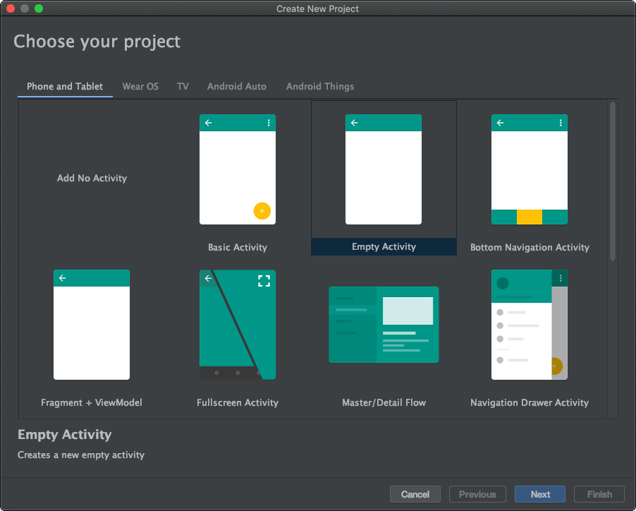
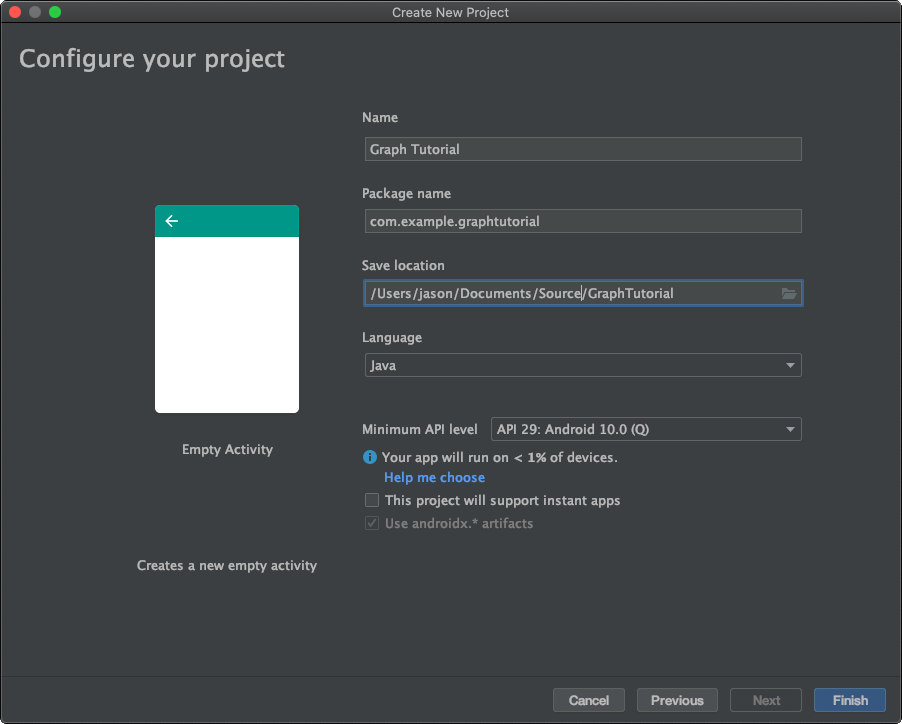
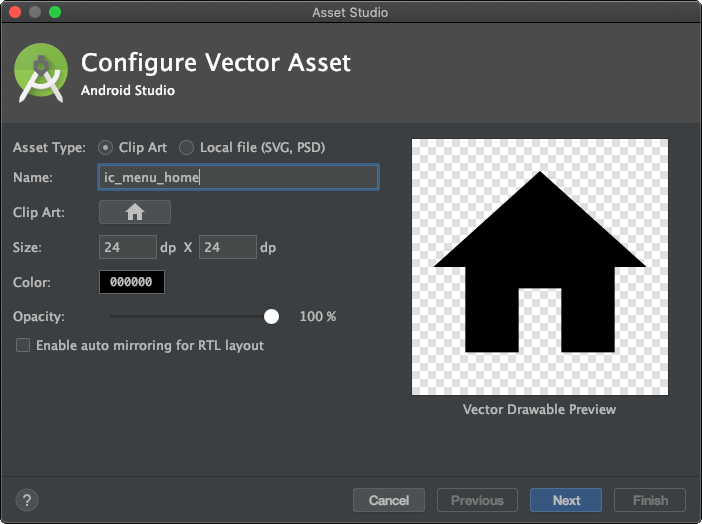
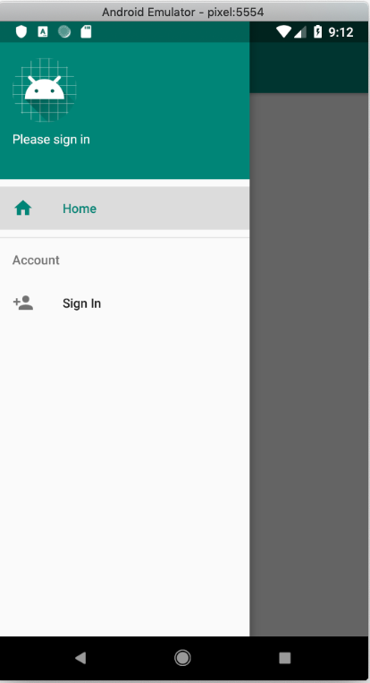

<!-- markdownlint-disable MD002 MD041 -->

Open Android Studio, and select **Start a new Android Studio project** on the welcome screen. In the **Create New Project** dialog, select **Empty Activity**, then select **Next**.



In the **Configure your project** dialog, set the **Name** to `Graph Tutorial`, ensure the **Language** field is set to `Java`, and ensure the **Minimum API level** is set to `API 27: Android 8.1 (Oreo)`. Modify the **Package name** and **Save location** as needed. Select **Finish**.



> [!IMPORTANT]
> Ensure that you enter the exact same name for the project that is specified in these lab instructions. The project name becomes part of the namespace in the code. The code inside these instructions depends on the namespace matching the project name specified in these instructions. If you use a different project name the code will not compile unless you adjust all the namespaces to match the project name you enter when you create the project.

Before moving on, install some additional dependencies that you will use later.

- `com.android.support:design` to make the navigation drawer layouts available to the app.
- [Microsoft Authentication Library (MSAL) for Android](https://github.com/AzureAD/microsoft-authentication-library-for-android) to handle Azure AD authentication and token management.
- [Microsoft Graph SDK for Java](https://github.com/microsoftgraph/msgraph-sdk-java) for making calls to the Microsoft Graph.

Expand **Gradle Scripts**, then open the **build.gradle (Module: app)** file. Add the following lines inside the `dependencies` value.

```Gradle
implementation 'com.android.support:design:28.0.0'
implementation 'com.microsoft.graph:microsoft-graph:1.4.0'
implementation 'com.microsoft.identity.client:msal:0.2.+'
```

> [!NOTE]
> If you are using a different SDK version, make sure to change the `28.0.0` to match the version of the `com.android.support:appcompat-v7` dependency already present in **build.gradle**.

Add a `packagingOptions` inside the `android` value in the **build.gradle (Module: app)** file.

```Gradle
packagingOptions {
    pickFirst 'META-INF/jersey-module-version'
}
```

Save your changes. On the **File** menu, select **Sync Project with Gradle Files**.

## Design the app

The application will use a [navigation drawer](https://developer.android.com/training/implementing-navigation/nav-drawer) to navigate between different views. In this step you will update the activity to use a navigation drawer layout, and add fragments for the views.

### Create a navigation drawer

Start by creating icons for the app's navigation menu. Right-click the **app/res/drawable** folder and select **New**, then **Vector Asset**. Click the icon button next to **Clip Art**. In the **Select Icon** window, type `home` in the search bar, then select the **Home** icon and select **OK**. Change the **Name** to `ic_menu_home`.



Select **Next**, then **Finish**. Repeat this step to create two more icons.

- Name: `ic_menu_calendar`, Icon: `event`
- Name: `ic_menu_signout`, Icon: `exit to app`
- Name: `ic_menu_signin`, Icon: `person add`

Next, create a menu for the application. Right-click the **res** folder and select **New**, then **Android Resource Directory**. Change the **Resource type** to `menu` and select **OK**.

Right-click the new **menu** folder and select **New**, then **Menu resource file**. Name the file `drawer_menu` and select **OK**. When the file opens, select the **Text** tab to view the XML, then replace the entire contents with the following.

```xml
<?xml version="1.0" encoding="utf-8"?>
<menu xmlns:android="http://schemas.android.com/apk/res/android"
    xmlns:tools="http://schemas.android.com/tools"
    tools:showIn="navigation_view">

    <group android:checkableBehavior="single">
        <item
            android:id="@+id/nav_home"
            android:icon="@drawable/ic_menu_home"
            android:title="Home" />

        <item
            android:id="@+id/nav_calendar"
            android:icon="@drawable/ic_menu_calendar"
            android:title="Calendar" />
    </group>

    <item android:title="Account">
        <menu>
            <item
                android:id="@+id/nav_signin"
                android:icon="@drawable/ic_menu_signin"
                android:title="Sign In" />

            <item
                android:id="@+id/nav_signout"
                android:icon="@drawable/ic_menu_signout"
                android:title="Sign Out" />
        </menu>
    </item>

</menu>
```

Now update the application's theme to be compatible with a navigation drawer. Open the **app/res/values/styles.xml** file. Replace `Theme.AppCompat.Light.DarkActionBar` with `Theme.AppCompat.Light.NoActionBar`. Then add the following lines inside the `style` element.

```xml
<item name="windowActionBar">false</item>
<item name="windowNoTitle">true</item>
<item name="android:statusBarColor">@android:color/transparent</item>
```

Next, create a header for the menu. Right-click the **app/res/layout** folder. Select **New**, then **Layout resource file**. Name the file `nav_header` and change the **Root element** to `LinearLayout`. Select **OK**.

Open the **nav_header.xml** file and select the **Text** tab. Replace the entire contents with the following.

```xml
<?xml version="1.0" encoding="utf-8"?>
<<?xml version="1.0" encoding="utf-8"?>
<LinearLayout xmlns:android="http://schemas.android.com/apk/res/android"
    android:layout_width="match_parent"
    android:layout_height="176dp"
    android:background="@color/colorPrimary"
    android:gravity="bottom"
    android:orientation="vertical"
    android:padding="16dp"
    android:theme="@style/ThemeOverlay.AppCompat.Dark">

    <ImageView
        android:id="@+id/user_profile_pic"
        android:layout_width="wrap_content"
        android:layout_height="wrap_content"
        android:src="@mipmap/ic_launcher" />

    <TextView
        android:id="@+id/user_name"
        android:layout_width="wrap_content"
        android:layout_height="wrap_content"
        android:paddingTop="8dp"
        android:text="Test User"
        android:textAppearance="@style/TextAppearance.AppCompat.Body1" />

    <TextView
        android:id="@+id/user_email"
        android:layout_width="wrap_content"
        android:layout_height="wrap_content"
        android:text="test@contoso.com" />

</LinearLayout>
```

Now, open the **app/res/layout/activity_main.xml** file. Update the layout to a `DrawerLayout` by replacing the existing XML with the following.

```xml
<?xml version="1.0" encoding="utf-8"?>
<android.support.v4.widget.DrawerLayout xmlns:android="http://schemas.android.com/apk/res/android"
    xmlns:app="http://schemas.android.com/apk/res-auto"
    xmlns:tools="http://schemas.android.com/tools"
    android:id="@+id/drawer_layout"
    android:layout_width="match_parent"
    android:layout_height="match_parent"
    android:fitsSystemWindows="true"
    tools:context=".MainActivity"
    tools:openDrawer="start">

    <RelativeLayout
        android:layout_width="match_parent"
        android:layout_height="match_parent"
        android:orientation="vertical">

        <ProgressBar
            android:id="@+id/progressbar"
            android:layout_width="75dp"
            android:layout_height="75dp"
            android:layout_centerInParent="true"
            android:visibility="gone"/>

        <android.support.v7.widget.Toolbar
            android:id="@+id/toolbar"
            android:layout_width="match_parent"
            android:layout_height="?attr/actionBarSize"
            android:background="@color/colorPrimary"
            android:elevation="4dp"
            android:theme="@style/ThemeOverlay.AppCompat.Dark.ActionBar" />

        <FrameLayout
            android:id="@+id/fragment_container"
            android:layout_width="match_parent"
            android:layout_height="match_parent"
            android:layout_below="@+id/toolbar" />
    </RelativeLayout>

    <android.support.design.widget.NavigationView
        android:id="@+id/nav_view"
        android:layout_width="wrap_content"
        android:layout_height="match_parent"
        android:layout_gravity="start"
        app:headerLayout="@layout/nav_header"
        app:menu="@menu/drawer_menu" />

</android.support.v4.widget.DrawerLayout>
```

Next, open **app/res/values/strings.xml**. Add the following elements inside the `resources` element.

```xml
<string name="navigation_drawer_open">Open navigation drawer</string>
<string name="navigation_drawer_close">Close navigation drawer</string>
```

Finally, open the **app/java/com.example/graphtutorial/MainActivity** file. Replace the entire contents with the following.

```java
package com.example.graphtutorial;

import android.support.annotation.NonNull;
import android.support.design.widget.NavigationView;
import android.support.v4.view.GravityCompat;
import android.support.v4.widget.DrawerLayout;
import android.support.v7.app.ActionBarDrawerToggle;
import android.support.v7.app.AppCompatActivity;
import android.os.Bundle;
import android.support.v7.widget.Toolbar;
import android.view.Menu;
import android.view.MenuItem;
import android.view.View;
import android.widget.FrameLayout;
import android.widget.ProgressBar;
import android.widget.TextView;

public class MainActivity extends AppCompatActivity implements NavigationView.OnNavigationItemSelectedListener {
    private DrawerLayout mDrawer;
    private NavigationView mNavigationView;
    private View mHeaderView;
    private boolean mIsSignedIn = false;
    private String mUserName = null;
    private String mUserEmail = null;

    @Override
    protected void onCreate(Bundle savedInstanceState) {
        super.onCreate(savedInstanceState);
        setContentView(R.layout.activity_main);

        // Set the toolbar
        Toolbar toolbar = findViewById(R.id.toolbar);
        setSupportActionBar(toolbar);

        mDrawer = findViewById(R.id.drawer_layout);

        // Add the hamburger menu icon
        ActionBarDrawerToggle toggle = new ActionBarDrawerToggle(this, mDrawer, toolbar,
                R.string.navigation_drawer_open, R.string.navigation_drawer_close);
        mDrawer.addDrawerListener(toggle);
        toggle.syncState();

        mNavigationView = findViewById(R.id.nav_view);

        // Set user name and email
        mHeaderView = mNavigationView.getHeaderView(0);
        setSignedInState(mIsSignedIn);

        // Listen for item select events on menu
        mNavigationView.setNavigationItemSelectedListener(this);
    }

    @Override
    public boolean onNavigationItemSelected(@NonNull MenuItem menuItem) {
        // TEMPORARY
        return false;
    }

    @Override
    public void onBackPressed() {
        if (mDrawer.isDrawerOpen(GravityCompat.START)) {
            mDrawer.closeDrawer(GravityCompat.START);
        } else {
            super.onBackPressed();
        }
    }

    public void showProgressBar()
    {
        FrameLayout container = findViewById(R.id.fragment_container);
        ProgressBar progressBar = findViewById(R.id.progressbar);
        container.setVisibility(View.GONE);
        progressBar.setVisibility(View.VISIBLE);
    }

    public void hideProgressBar()
    {
        FrameLayout container = findViewById(R.id.fragment_container);
        ProgressBar progressBar = findViewById(R.id.progressbar);
        progressBar.setVisibility(View.GONE);
        container.setVisibility(View.VISIBLE);
    }

    // Update the menu and get the user's name and email
    private void setSignedInState(boolean isSignedIn) {
        mIsSignedIn = isSignedIn;

        Menu menu = mNavigationView.getMenu();

        // Hide/show the Sign in, Calendar, and Sign Out buttons
        menu.findItem(R.id.nav_signin).setVisible(!isSignedIn);
        menu.findItem(R.id.nav_calendar).setVisible(isSignedIn);
        menu.findItem(R.id.nav_signout).setVisible(isSignedIn);

        // Set the user name and email in the nav drawer
        TextView userName = mHeaderView.findViewById(R.id.user_name);
        TextView userEmail = mHeaderView.findViewById(R.id.user_email);

        if (isSignedIn) {
            // For testing
            mUserName = "Megan Bowen";
            mUserEmail = "meganb@contoso.com";

            userName.setText(mUserName);
            userEmail.setText(mUserEmail);
        } else {
            mUserName = null;
            mUserEmail = null;

            userName.setText("Please sign in");
            userEmail.setText("");
        }
    }
}
```

### Add fragments

Right-click the **app/res/layout** folder and select **New**, then **Layout resource file**. Name the file `fragment_home` and change the **Root element** to `RelativeLayout`. Select **OK**.

Open the **fragment_home.xml** file and replace its contents with the following.

```xml
<?xml version="1.0" encoding="utf-8"?>
<RelativeLayout xmlns:android="http://schemas.android.com/apk/res/android"
    android:layout_width="match_parent"
    android:layout_height="match_parent">

    <LinearLayout
        android:layout_width="wrap_content"
        android:layout_height="wrap_content"
        android:layout_centerInParent="true"
        android:orientation="vertical">

        <TextView
            android:layout_width="wrap_content"
            android:layout_height="wrap_content"
            android:layout_gravity="center_horizontal"
            android:text="Welcome!"
            android:textSize="30sp" />

        <TextView
            android:id="@+id/home_page_username"
            android:layout_width="wrap_content"
            android:layout_height="wrap_content"
            android:layout_gravity="center_horizontal"
            android:paddingTop="8dp"
            android:text="Please sign in"
            android:textSize="20sp" />
    </LinearLayout>

</RelativeLayout>
```

Next, right-click the **app/res/layout** folder and select **New**, then **Layout resource file**. Name the file `fragment_calendar` and change the **Root element** to `RelativeLayout`. Select **OK**.

Open the **fragment_calendar.xml** file and replace its contents with the following.

```xml
<?xml version="1.0" encoding="utf-8"?>
<RelativeLayout xmlns:android="http://schemas.android.com/apk/res/android"
    android:layout_width="match_parent"
    android:layout_height="match_parent">

    <TextView
        android:layout_width="wrap_content"
        android:layout_height="wrap_content"
        android:layout_centerInParent="true"
        android:text="Calendar"
        android:textSize="30sp" />

</RelativeLayout>
```

Now, right-click the **app/java/com.example.graphtutorial** folder and select **New**, then **Java Class**. Name the class `HomeFragment` and set the **Superclass** to `android.support.v4.app.Fragment`. Select **OK**. Open the **HomeFragment** file and replace its contents with the following.

```java
package com.example.graphtutorial;

import android.os.Bundle;
import android.support.annotation.NonNull;
import android.support.annotation.Nullable;
import android.support.v4.app.Fragment;
import android.view.LayoutInflater;
import android.view.View;
import android.view.ViewGroup;
import android.widget.TextView;

public class HomeFragment extends Fragment {
    private static final String USER_NAME = "userName";

    private String mUserName;

    public HomeFragment() {

    }

    public static HomeFragment createInstance(String userName) {
        HomeFragment fragment = new HomeFragment();

        // Add the provided username to the fragment's arguments
        Bundle args = new Bundle();
        args.putString(USER_NAME, userName);
        fragment.setArguments(args);
        return fragment;
    }

    @Override
    public void onCreate(@Nullable Bundle savedInstanceState) {
        super.onCreate(savedInstanceState);
        if (getArguments() != null) {
            mUserName = getArguments().getString(USER_NAME);
        }
    }

    @Nullable
    @Override
    public View onCreateView(@NonNull LayoutInflater inflater, @Nullable ViewGroup container, @Nullable Bundle savedInstanceState) {
        View homeView = inflater.inflate(R.layout.fragment_home, container, false);

        // If there is a username, replace the "Please sign in" with the username
        if (mUserName != null) {
            TextView userName = homeView.findViewById(R.id.home_page_username);
            userName.setText(mUserName);
        }

        return homeView;
    }
}
```

Next, right-click the **app/java/com.example.graphtutorial** folder and select **New**, then **Java Class**. Name the class `CalendarFragment` and set the **Superclass** to `android.support.v4.app.Fragment`. Select **OK**.

Open the **CalendarFragment** file and add the following function to the `CalendarFragment` class.

```java
@Nullable
@Override
public View onCreateView(@NonNull LayoutInflater inflater, @Nullable ViewGroup container, @Nullable Bundle savedInstanceState) {
    return inflater.inflate(R.layout.fragment_calendar, container, false);
}
```

Now that the fragments are implemented, update the `MainActivity` class to handle the `onNavigationItemSelected` event and use the fragments. First, add the following functions to the class.

```java
// Load the "Home" fragment
public void openHomeFragment(String userName) {
    HomeFragment fragment = HomeFragment.createInstance(userName);
    getSupportFragmentManager().beginTransaction()
            .replace(R.id.fragment_container, fragment)
            .commit();
    mNavigationView.setCheckedItem(R.id.nav_home);
}

// Load the "Calendar" fragment
private void openCalendarFragment() {
    getSupportFragmentManager().beginTransaction()
            .replace(R.id.fragment_container, new CalendarFragment())
            .commit();
    mNavigationView.setCheckedItem(R.id.nav_calendar);
}

private void signIn() {
    setSignedInState(true);
    openHomeFragment(mUserName);
}

private void signOut() {
    setSignedInState(false);
    openHomeFragment(mUserName);
}
```

Next, replace the existing `onNavigationItemSelected` function with the following.

```java
@Override
public boolean onNavigationItemSelected(@NonNull MenuItem menuItem) {
    // Load the fragment that corresponds to the selected item
    switch (menuItem.getItemId()) {
        case R.id.nav_home:
            openHomeFragment(mUserName);
            break;
        case R.id.nav_calendar:
            openCalendarFragment();
            break;
        case R.id.nav_signin:
            signIn();
            break;
        case R.id.nav_signout:
            signOut();
            break;
    }

    mDrawer.closeDrawer(GravityCompat.START);

    return true;
}
```

Finally, add the following at the end of the `onCreate` function to load the home fragment when the app starts.

```java
// Load the home fragment by default on startup
if (savedInstanceState == null) {
    openHomeFragment(mUserName);
}
```

Save all of your changes. On the **Run** menu, select **Run 'app'**. The app's menu should work to navigate between the two fragments and change when you tap the **Sign in** or **Sign out** buttons.


